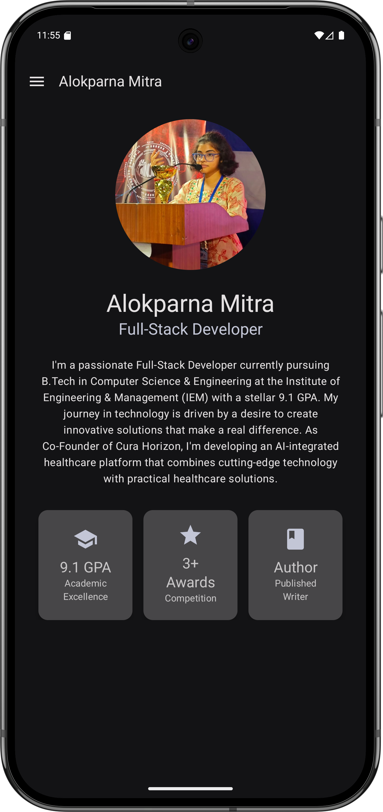
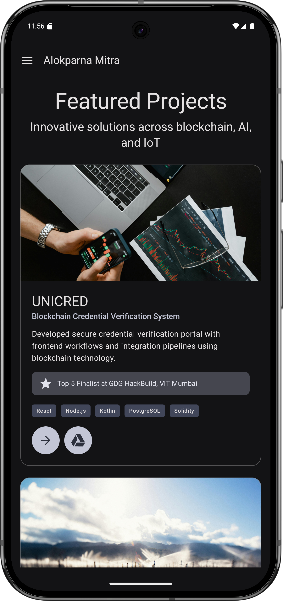
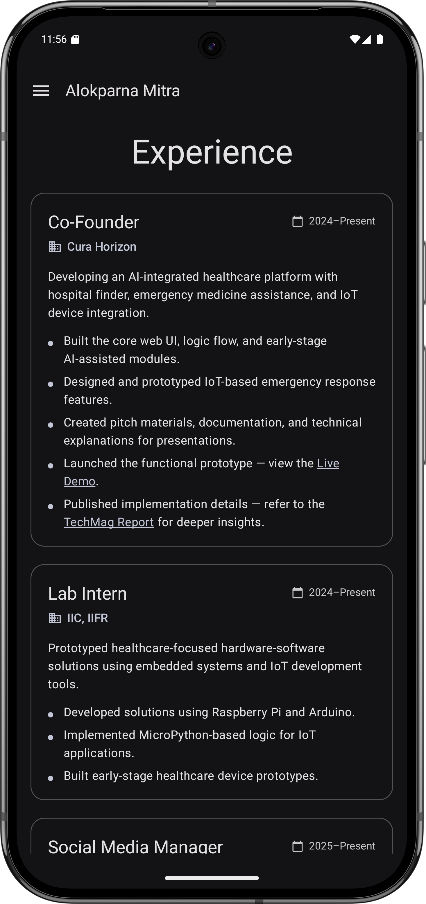
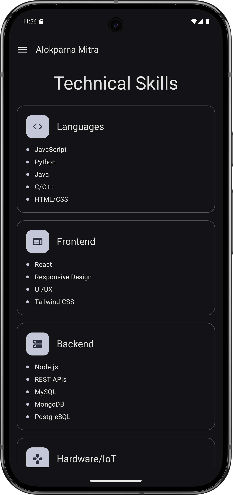
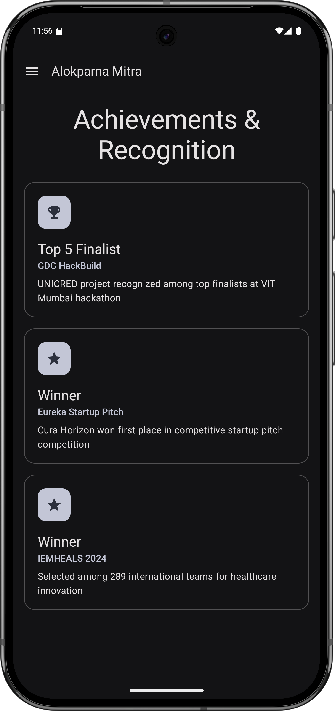
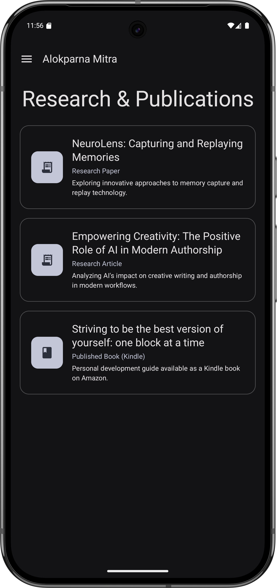
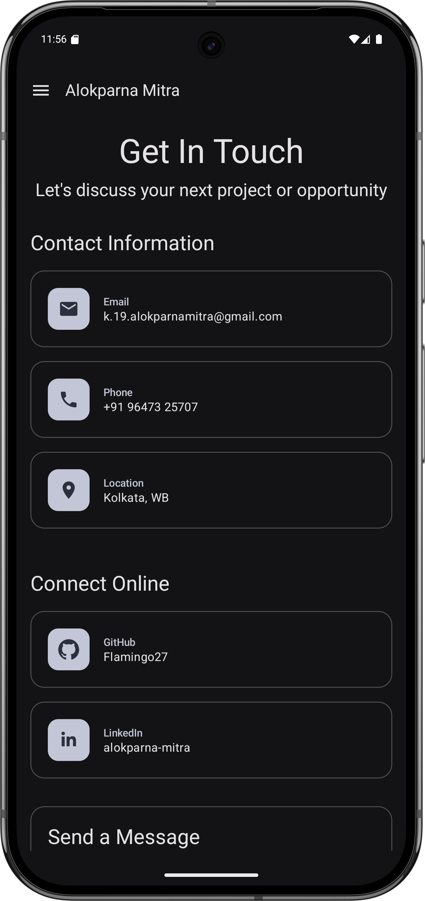

# Alokparna Mitra - Native Android Portfolio App

This is a fully native Android application built with Kotlin and Jetpack Compose to showcase the professional portfolio of Alokparna Mitra. The app is designed with a modern, clean aesthetic using Material You principles, and it dynamically loads all portfolio data.

## ✨ Features

- **Dynamic Content**: All portfolio data (experience, education, projects, etc.) is loaded from a central repository, making it easy to update.
- **Material You Design**: The app embraces Material You, with a dynamic color scheme that adapts to the user's wallpaper and theme (including dark and AMOLED-friendly modes).
- **Jetpack Compose UI**: The entire user interface is built with Jetpack Compose, Android's modern, declarative UI toolkit.
- **Welcome Screen**: A beautiful hero screen greets the user on the first launch.
- **Navigation Drawer**: An intuitive navigation drawer allows for easy navigation between the different sections of the portfolio.
- **Responsive Layouts**: Screens are designed to adapt to different screen sizes.
- **Functional Contact Form**: A "Get In Touch" screen that allows users to send a message directly to a backend service, with UI states for loading, success, and error.
- **Performant Image Loading**: Asynchronous image loading with caching (using Coil) for a smooth, lag-free scrolling experience.

## 🛠️ Tech Stack & Libraries

- **Kotlin**: The official programming language for Android development.
- **Jetpack Compose**: Android's modern toolkit for building native UI.
- **Material 3**: The latest version of Material Design, for Material You theming.
- **Compose Navigation**: For navigating between different screens and sections of the app.
- **Coroutines & Kotlin Flow**: For managing asynchronous operations and state.
- **Ktor Client**: For making network requests from the contact form.
- **Kotlinx Serialization**: For parsing JSON data in the networking layer.
- **Coil**: For efficient and performant image loading from drawable resources.

## 📸 Screenshots

| Hero | About | Projects |
| :---: | :---: | :---: |
|  |  |  |

| Experience | Skills | Achievements |
| :---: | :---: | :---: |
|  |  |  |

| Publications | Contact | |
| :---: | :---: | :---: |
|  |  | |

## 🚀 Setup & Building

To build and run the project, you'll need to create a keystore for signing the release version of the app.

### 1. Create a Keystore

If you don't already have a keystore file, you can generate one using Android Studio:

1.  Go to **Build** > **Generate Signed Bundle / APK**.
2.  Select **APK** and click **Next**.
3.  Click the **Create new...** button under the "Key store path" section.
4.  Fill in the required information and save the generated `keystore.jks` file in the root directory of the project.

### 2. Create `keystore.properties`

In the root directory of the project, create a file named `keystore.properties`. **This file should be added to your `.gitignore` to keep your credentials private.**

Add the following lines to the file, replacing the placeholder values with your actual keystore credentials:

```properties
storePassword=YOUR_KEYSTORE_PASSWORD
keyAlias=YOUR_KEY_ALIAS
keyPassword=YOUR_KEY_PASSWORD
```

### 3. Build the APK

Once your keystore and properties file are set up, you can build a release-ready APK by opening the terminal in Android Studio and running the following command:

```bash
./gradlew assembleRelease
```

The signed APK will be generated at `app/build/outputs/apk/release/app-release.apk`. You can then upload this file to a GitHub release or share it directly.

## 🔗 Related Projects

- **[Portfolio PWA](https://github.com/Flamingo27/portfolio-pwa)**: The Progressive Web App version of this portfolio, built with React and TypeScript.
- **[Portfolio Website](https://portfolio-alokparna.pages.dev)**: The live, deployed version of the portfolio website.

## 📄 License

This project is licensed under the MIT License - see the [LICENSE](LICENSE) file for details.
